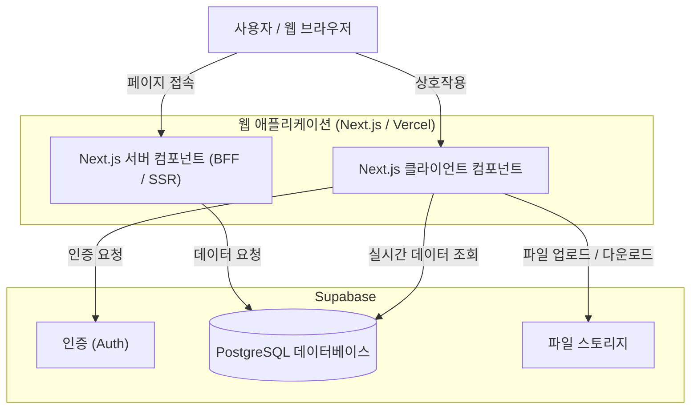
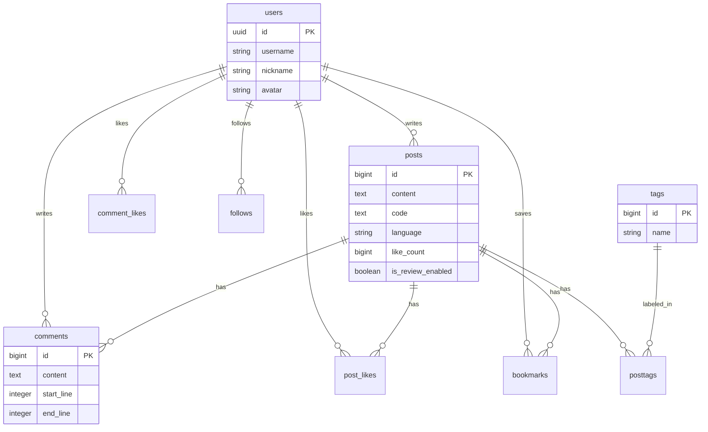

# CodeLog


코드 기반으로 소통하는 SNS, **CodeLog**입니다.

🔗 배포 주소: [codelog-delta.vercel.app](https://codelog-delta.vercel.app/)

## 목차

1. [주요 기능 소개](#1-주요-기능-소개)
2. [기술 스택 및 선정 이유](#2-기술-스택-및-선정-이유)
3. [아키텍처 및 데이터베이스](#3-아키텍처-및-데이터베이스)
4. [트러블 슈팅](#4-트러블-슈팅)
5. [시작하기](#5-시작하기)
6. [라이선스](#6-라이선스)

## 1. 주요 기능 소개

**CodeLog**는 개발자들이 지식을 기록하고 공유하는 데 최적화된 경험을 제공합니다.

### 1-1. 📝 코드 포스팅 & 아카이빙

개발 일지, 기술 아티클, 코드 스니펫을 손쉽게 작성하고 체계적으로 관리할 수 있습니다.

### 1-2. 🎨 강력한 코드 에디터

`react-simple-code-editor`와 `prism-react-renderer`를 활용하여 실시간 구문 강조(Syntax Highlighting)가 적용된 쾌적한 에디팅 환경을 제공합니다.

## 2. 기술 스택 및 선정 이유

### 2-1. Framework & Language

- **Next.js 16 (App Router)**: 최신 리액트 기능인 RSC(React Server Components)를 적극 활용하고, 직관적인 라우팅 구조와 뛰어난 퍼포먼스를 위해 채택했습니다.
- **TypeScript**: 컴파일 타임에 오류를 잡고, 코드의 안정성과 유지보수성을 높이기 위해 사용합니다.

### 2-2. Styling & UI

- **Tailwind CSS v4 & shadcn/ui**: 디자인 시스템의 일관성을 유지하면서도 높은 개발 생산성을 위해 `shadcn/ui`를 도입했습니다.

### 2-3. Backend & Database

- **Supabase**: 확장 가능한 PostgreSQL 데이터베이스와 즉시 사용 가능한 인증, 실시간 기능을 제공하여 빠른 개발 사이클을 가능하게 합니다.

## 3. 아키텍처 및 데이터베이스

### 3-1. 시스템 구조도



### 3-2. ERD



## 3-3. 디렉토리 구조

프로젝트의 주요 디렉토리 구조는 다음과 같습니다.

```
codelog/
├── src/
│   ├── app/          # App Router 페이지 및 레이아웃
│   ├── components/   # 재사용 가능한 UI 컴포넌트
│   ├── services/     # API 호출 및 비즈니스 로직
│   ├── hooks/        # 커스텀 React Hooks
│   ├── lib/          # 유틸리티 및 외부 라이브러리 설정
│   ├── types/        # 전역 TypeScript 타입 정의
│   ├── styles/       # 전역 스타일 설정
│   └── utils/        # 공통 헬퍼 함수
├── public/           # 정적 에셋
└── package.json
```

## 4. 트러블 슈팅

### 4-1. 렌더링 성능과 하이드레이션

- 🔗 [CodeLog 개발기 (1) 아키텍처와 코어 패턴](https://brad.kr/posts/codelog-architecture)
- **문제**: 부모 컴포넌트가 모든 데이터를 가져올 때까지 화면 전체가 멈추는 **Waterfall 현상**으로 초기 로딩이 느려졌습니다. 또한 셔플 기능을 위해 사용한 `Math.random()`이 서버와 클라이언트에서 서로 다른 값을 생성해 **하이드레이션 에러**를 유발했습니다.
- **해결**: 데이터 페칭 전략을 수정하여 비동기 로직을 자식 컴포넌트로 위임하고 **Suspense**로 감싸 점진적 렌더링을 구현했습니다. 랜덤 로직에는 시드 기반의 난수 생성 함수를 도입하여 양측의 렌더링 결과를 일치시켰습니다.
- **결과**: 핵심 컨텐츠가 준비되는 즉시 화면에 표시되어 사용자 체감 로딩 속도가 획기적으로 개선되었습니다. 하이드레이션 오류를 원천 차단하여 안정적인 UI 렌더링과 콘솔 에러 없는 쾌적한 개발 환경을 구축했습니다.

### 4-2. 데이터 무결성과 동시성 문제

- 🔗 [CodeLog 개발기 (2) 보안과 신뢰성](https://brad.kr/posts/codelog-data-security)
- **문제**: `Read-Modify-Write` 패턴 시, 다수의 사용자가 동시에 '좋아요'를 누르면 서로의 트랜잭션을 덮어쓰는 레이스 컨디션이 발생하여 카운트가 유실되는 심각한 문제가 있었습니다.
- **해결**: 값을 가져와서 계산하는 대신, 데이터베이스에 연산을 위임하는 아토믹 업데이트 쿼리를 적용했습니다. 추가로 **Postgres Trigger**를 설정하여 `posts`와 `likes` 테이블 간의 데이터 싱크가 100% 일치하도록 강제했습니다.
- **결과**: 복잡한 락 구현 없이도 동시 요청 트래픽에서 데이터 유실을 방지했습니다. DB 레벨에서 무결성을 보장하므로 애플리케이션 로직이 단순해지고 유지보수성이 향상되었습니다.

### 4-3. 아바타 캐싱과 즉각적인 반영

- 🔗 [CodeLog 개발기 (3) 코드 리뷰와 아바타 이미지 변경](https://brad.kr/posts/codelog-feature)
- **문제**: 프로필 사진을 변경했음에도 브라우저의 캐싱 정책으로 인해 새로고침 전까지는 이전 이미지가 계속 노출되었습니다. 이는 사용자에게 오해를 주는 UX 결함이었습니다.
- **해결**: 이미지 URL 뒤에 `?v={timestamp}` 쿼리 파라미터를 동적으로 붙여 브라우저가 매번 새로운 자원으로 인식하게 만드는 캐시 버스팅을 적용했습니다. 동시에 서버 응답을 기다리지 않고 로컬 상태를 먼저 업데이트하는 **Optimistic UI**를 구현했습니다.
- **결과**: 사용자는 업로드 버튼을 누르는 즉시 변경된 프로필 이미지를 확인할 수 있게 되었습니다. 불필요한 서버 부하 없이 브라우저의 동작 원리와 상태 관리 패턴으로 사용자 경험을 개선했습니다.

## 5. 시작하기

직접 Supabase 프로젝트를 생성하고 연결하여, 나만의 Codelog 서비스를 즉시 배포하고 운영할 수 있습니다.

### 5-1. 준비사항

- **Node.js**: v18.17.0 이상 (Next.js 16 요구사항)
- **npm** (또는 yarn, pnpm과 같은 패키지 매니저)
- **Supabase Account**: 백엔드 및 DB 구성을 위해 필요

### 5-2. 설치 및 실행

1. **저장소 클론 (Clone Repository)**

```bash
git clone https://github.com/your-username/codelog.git
cd codelog
```

2. **의존성 설치 (Install Dependencies)**

```bash
npm install
```

3. **환경 변수 설정 (Environment Setup)**

루트 경로에 `.env.local` 파일을 생성하고 Supabase 키를 입력하세요.

```env
NEXT_PUBLIC_SUPABASE_URL=your_supabase_project_url
NEXT_PUBLIC_SUPABASE_ANON_KEY=your_supabase_anon_key
```

4. **로컬 서버 실행 (Run Local Server)**

```bash
npm run dev
```

## 6. 라이선스

이 프로젝트는 **CC BY-NC 4.0** (Creative Commons Attribution-NonCommercial 4.0 International License) 라이선스를 따릅니다.

- ✅ **개인 학습 및 비영리 목적의 사용**: 자유롭게 코드를 참고, 수정 및 사용할 수 있습니다.
- 🚫 **상업적 이용 금지**: 저작권자의 허락 없이 이 코드를 기반으로 한 서비스를 유료로 배포하거나 수익을 창출하는 행위는 금지됩니다.
