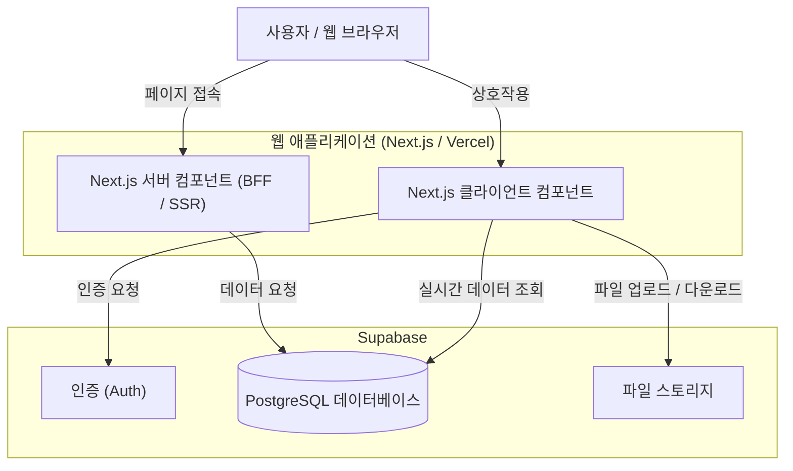
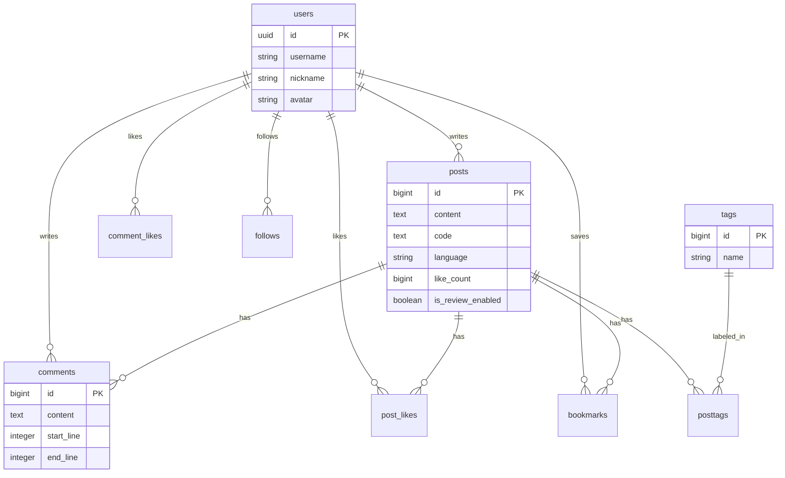

# CodeLog


코드 기반으로 소통하는 SNS, **CodeLog**입니다.

🔗 배포 주소: [codelog-delta.vercel.app](https://codelog-delta.vercel.app/)

## 목차

1. [주요 기능 소개](#1-주요-기능-소개)
2. [기술 스택 및 선정 이유](#2-기술-스택-및-선정-이유)
3. [아키텍처 및 데이터베이스](#3-아키텍처-및-데이터베이스)
4. [트러블 슈팅](#4-트러블-슈팅)
5. [시작하기](#5-시작하기)
6. [라이선스](#6-라이선스)

## 1. 주요 기능 소개

**CodeLog**는 개발자들이 지식을 기록하고 공유하는 데 최적화된 경험을 제공합니다.

### 1-1. 📝 코드 포스팅 & 아카이빙

개발 일지, 기술 아티클, 코드 스니펫을 손쉽게 작성하고 체계적으로 관리할 수 있습니다.

### 1-2. 🎨 강력한 코드 에디터

`react-simple-code-editor`와 `prism-react-renderer`를 활용하여 실시간 구문 강조(Syntax Highlighting)가 적용된 쾌적한 에디팅 환경을 제공합니다.

## 2. 기술 스택 및 선정 이유

### 2-1. Framework & Language

- **Next.js 16 (App Router)**: 최신 리액트 기능인 RSC(React Server Components)를 적극 활용하고, 직관적인 라우팅 구조와 뛰어난 퍼포먼스를 위해 채택했습니다.
- **TypeScript**: 컴파일 타임에 오류를 잡고, 코드의 안정성과 유지보수성을 높이기 위해 사용합니다.

### 2-2. Styling & UI

- **Tailwind CSS v4 & shadcn/ui**: 디자인 시스템의 일관성을 유지하면서도 높은 개발 생산성을 위해 `shadcn/ui`를 도입했습니다.

### 2-3. Backend & Database

- **Supabase**: 확장 가능한 PostgreSQL 데이터베이스와 즉시 사용 가능한 인증, 실시간 기능을 제공하여 빠른 개발 사이클을 가능하게 합니다.

## 3. 아키텍처 및 데이터베이스

### 3-1. 시스템 구조도


```mermaid
graph TD
    User[사용자 / 웹 브라우저]

    subgraph "웹 애플리케이션 (Next.js / Vercel)"
        Client[Next.js 클라이언트 컴포넌트]
        Server["Next.js 서버 컴포넌트 (BFF / SSR)"]
    end

    subgraph "Supabase"
        Auth["인증 (Auth)"]
        DB[("PostgreSQL 데이터베이스")]
        Storage[파일 스토리지]
    end

    User -->|페이지 접속| Server
    User -->|상호작용| Client

    Server -->|데이터 요청| DB
    Client -->|인증 요청| Auth
    Client -->|실시간 데이터 조회| DB
    Client -->|파일 업로드 / 다운로드| Storage
```

### 3-2. ERD


```mermaid
erDiagram
    users ||--o{ posts : writes
    users ||--o{ comments : writes
    users ||--o{ post_likes : likes
    users ||--o{ comment_likes : likes
    users ||--o{ bookmarks : saves
    users ||--o{ follows : follows

    posts ||--o{ comments : has
    posts ||--o{ post_likes : has
    posts ||--o{ bookmarks : has
    posts ||--o{ posttags : has

    tags ||--o{ posttags : labeled_in

    users {
        uuid id PK
        string username
        string nickname
        string avatar
    }

    posts {
        bigint id PK
        text content
        text code
        string language
        bigint like_count
        boolean is_review_enabled
    }

    comments {
        bigint id PK
        text content
        integer start_line
        integer end_line
    }

    tags {
        bigint id PK
        string name
    }
```

### 3-3. 디렉토리 구조

<!-- readme-sync:structure:start -->
```text
codelog/
├── app/               # App Router route entries, layout, and metadata
├── pages/             # Guard directory so Next.js does not treat src/pages as Pages Router
├── public/            # Static assets served as-is
├── src/               # Application layers and shared code
│   ├── pages/             # Page-level compositions in the FSD Pages layer
│   ├── widgets/           # Composite UI sections
│   ├── features/          # User-facing flows and interactions
│   ├── entities/          # Domain models and API layers
│   ├── shared/            # Shared UI, libraries, styles, and types
│   └── proxy.ts           # Request proxy entrypoint
├── test/              # Vitest setup and Node-oriented tests
└── package.json       # NPM scripts and dependency manifest
```
<!-- readme-sync:structure:end -->

## 4. 시작하기

직접 Supabase 프로젝트를 생성하고 연결하여, 나만의 CodeLog 서비스를 즉시 배포하고 운영할 수 있습니다.

### 4-1. 준비사항

- **Node.js**: v20.9.0 이상 (Next.js 16 공식 요구사항)
- **npm**
- **Supabase Account**: 백엔드 및 DB 구성을 위해 필요

### 4-2. 설치 및 실행

1. **저장소 클론 (Clone Repository)**

```bash
git clone https://github.com/parkblo/codelog.git
cd codelog
```

2. **의존성 설치 (Install Dependencies)**

```bash
npm install
```

3. **환경 변수 설정 (Environment Setup)**

루트 경로에 `.env.local` 파일을 생성하고 Supabase 키를 입력하세요.

```env
NEXT_PUBLIC_SUPABASE_URL=your_supabase_project_url
NEXT_PUBLIC_SUPABASE_ANON_KEY=your_supabase_anon_key

# PostHog
NEXT_PUBLIC_POSTHOG_KEY=your_posthog_project_api_key
NEXT_PUBLIC_POSTHOG_HOST=https://us.i.posthog.com

# Sentry (Client/Server 공통)
NEXT_PUBLIC_SENTRY_DSN=your_sentry_dsn
NEXT_PUBLIC_SENTRY_ENABLED=true
NEXT_PUBLIC_SENTRY_TRACES_SAMPLE_RATE=0.2
NEXT_PUBLIC_SENTRY_REPLAYS_SESSION_SAMPLE_RATE=0.05
NEXT_PUBLIC_SENTRY_REPLAYS_ON_ERROR_SAMPLE_RATE=1

# Sentry Source Map Upload (배포 환경 권장)
SENTRY_AUTH_TOKEN=your_sentry_auth_token
SENTRY_ORG=your_sentry_org_slug
SENTRY_PROJECT=your_sentry_project_slug
```

> **Tip**: Vercel CLI를 사용하면 다음 명령어로 환경 변수를 한 번에 가져올 수 있습니다.
> (최초 실행 시 `npx vercel link`로 프로젝트 연결이 필요할 수 있습니다.)
>
> ```bash
> npm run env:pull
> ```

4. **로컬 서버 실행 (Run Local Server)**

```bash
npm run dev
```

### 4-3. 주요 스크립트

아래 표는 `package.json`의 `scripts`를 기준으로 자동 동기화됩니다.

<!-- readme-sync:commands:start -->
| 스크립트 | 실제 명령 |
| --- | --- |
| `npm run dev` | `next dev` |
| `npm run build` | `next build` |
| `npm run start` | `next start` |
| `npm run lint` | `eslint` |
| `npm run check:readme` | `node scripts/readme-sync.mjs check` |
| `npm run sync:readme` | `node scripts/readme-sync.mjs sync` |
| `npm run test` | `vitest run` |
| `npm run test:watch` | `vitest` |
| `npm run env:pull` | `npx vercel env pull .env.local` |
| `npm run test:coverage` | `vitest run --coverage` |
<!-- readme-sync:commands:end -->

## 5. 라이선스

이 프로젝트는 **CC BY-NC 4.0** (Creative Commons Attribution-NonCommercial 4.0 International License) 라이선스를 따릅니다.

- ✅ **저작자 표시 (Attribution)**: 코드를 사용·수정·배포할 때는 원저작자(프로젝트명, 저장소 링크 등)를 명확히 표시해야 합니다.
- 🚫 **상업적 이용 금지**: 저작권자의 사전 허락 없이 이 코드를 기반으로 한 서비스를 유료로 배포하거나 수익을 창출하는 행위는 금지됩니다.

위 bullet들은 이해를 돕기 위한 요약이며, 법적 효력이 있는 전체 라이선스 전문은 저장소의 `LICENSE` 파일을 참고하세요.
